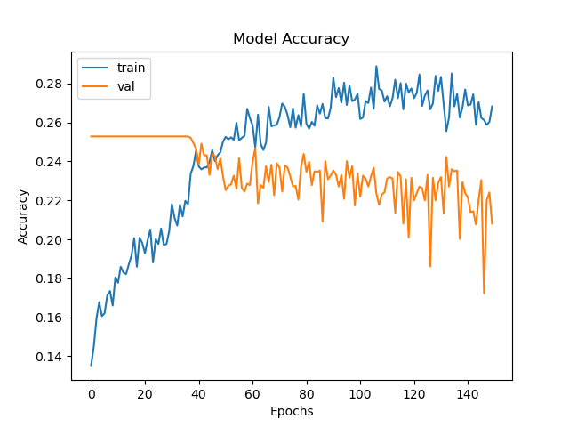
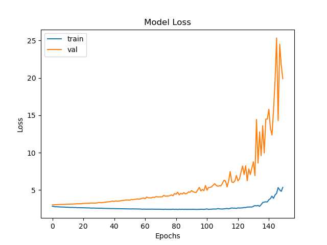
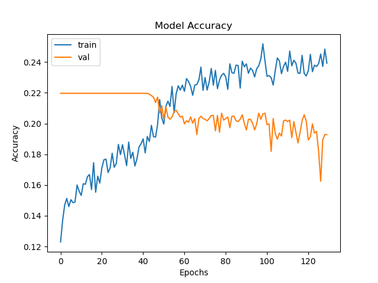
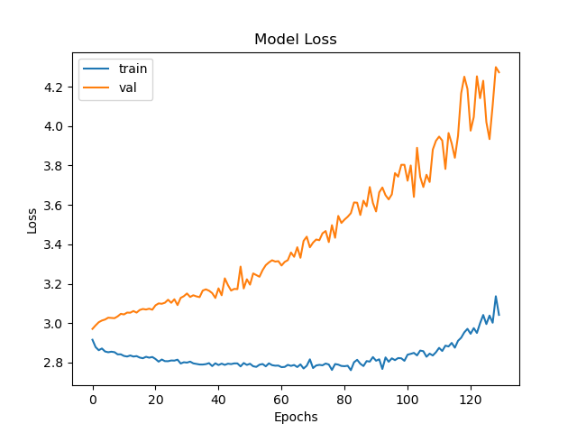

# Music_reco : projet 2nd trimestre en IA à l'UQAC

Teammate : [Alexandre Radin](https://github.com/AlexandreR4)

Dataset utilisé : [IRMAS](https://www.upf.edu/web/mtg/irmas)

### Les étapes souhaitées

- Générer un csv avec la correspondance entre les instruments et les pistes audio.
  - On crée une ligne par couple (piste, instrument), et on pourra les récupérer facilement sous forme de dataframe.
  
- Première étape : on input une piste .wav au modèle, qui output une liste des instruments
  - Prendre 3.0 secondes de chaque extrait pour les tests (avec le bout de code commenté)

- Étape finale : on fait écouter un audio au modèle, qui output en temps réel une liste d'instruments

Raccourcis : cello (cel), clarinet (cla), flute (flu), acoustic guitar (gac), electric guitar (gel), organ (org), piano (pia), saxophone (sax), trumpet (tru), violin (vio), and human singing voice (voi)

### Ce qu'on a fait (spoil : projet très exploratoire)

- Génération des csv de données pour le traitement ensuite

- Création d'un modèle et énormément de tests

- Application d'un 3-fold cross validation avec un grid search pour trouver les meilleurs hyper-paramètres

- Affichage des résultats

#### batch_size = 8, validation_split = 0.4, 150 epochs 

Notre meilleur résultat en accuracy

#### batch_size = 32, validation_split = 0.4, 150 epochs 

Notre meilleur résultat en loss

